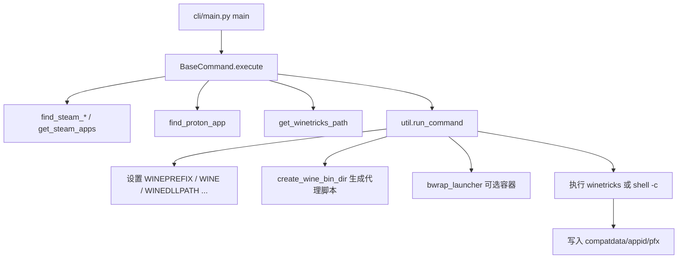

# Protontricks 修复 Proton 游戏的逻辑分析报告

> 分析对象：`fixing_tools/protontricks`
> 一句话定位：Protontricks 是面向 **Steam Play / Proton** 的 **Winetricks 包装器**，负责自动定位游戏的 Proton 运行环境（Wine prefix + Proton 版 wine + Steam Runtime），然后在该环境中调用 winetricks 安装缺失的运行库来"修复"游戏。

---

## 1. 整体定位：它解决什么问题

Protontricks 本身**不修改 Proton 二进制，也不内置任何运行库安装逻辑**。它本质上是 winetricks 的"环境编排器"。

直接对裸用 winetricks 来修 Proton 游戏，会遇到以下困难，Protontricks 逐一自动化解决：

| 裸用 Winetricks 的困难 | Protontricks 的做法 |
|------------------------|---------------------|
| 不知道该用哪个 `WINEPREFIX` | 解析 Steam 元数据，定位 `steamapps/compatdata/<appid>/pfx` |
| 系统 Wine 与 Proton 的 Wine 不一致 | 指向 Proton 安装内 `files/`（或旧版 `dist/`）下的 wine |
| `LD_LIBRARY_PATH` / Steam Runtime 不匹配 | 配置 Steam Runtime（legacy / bwrap 容器）+ 代理脚本 |
| 需要手动查 appid、Proton 版本 | 解析 VDF、`appmanifest_*.acf`、`config.vdf`、`appinfo.vdf` |

**入口**：`protontricks` 命令 → `protontricks.cli.main:cli` → `main()`（`src/protontricks/cli/main.py`）。

**"修复"的本质**：在游戏**已经至少被 Steam/Proton 启动过一次**而生成的 prefix 里，用与 Steam 启动游戏时**等价的 Proton + 环境**，执行 winetricks 的 verb（如 `vcrun2019`、`dotnet48`、`d3dx9`、字体等），补齐 Proton 未自带的闭源/专有运行库。

---

## 2. 发现 Steam 安装、游戏库与已安装游戏

核心实现在 `src/protontricks/steam.py`。

### 2.1 发现 Steam 安装
`find_steam_installations()` / `find_steam_path()`：
- 环境变量 `STEAM_DIR`（若设置且包含 `steamapps` + `ubuntu12_32`，则唯一采用）。
- 默认候选 `COMMON_STEAM_DIRS`：`~/.steam/steam`、`~/.local/share/Steam`。
- Flatpak 版 Steam：`~/.var/app/com.valvesoftware.Steam/.local/share/Steam`。
- Snap 版：`SNAP_STEAM_DIRS`。
- `steam_root`（`~/.steam/root`）用于定位 runtime 与 `compatibilitytools.d`。
- 检测到多套安装时，CLI 默认取第一个并告警；GUI 用 `select_steam_installation()` 让用户选择。

### 2.2 发现游戏库（多硬盘库）
`get_steam_lib_paths(steam_path)`：读取 `<steamapps>/libraryfolders.vdf` 解析所有额外库路径（Flatpak 下会做路径映射）。

### 2.3 发现已安装游戏
`get_steam_apps(...)` 汇总三类来源：
1. **官方游戏**：各库的 `steamapps/appmanifest_*.acf` → `SteamApp.from_appmanifest()`。
2. **自定义兼容工具**：`get_custom_compat_tool_installations()`（`compatibilitytools.d`）。
3. **非 Steam 快捷方式**：`get_custom_windows_shortcuts()`（`shortcuts.vdf` + CRC 生成的 appid）。

`SteamApp` 关键属性：
- `is_windows_app`：prefix 存在且本身不是 Proton 本体 → 可作为 winetricks 目标。
- `prefix_path_exists`：要求 `compatdata/<appid>/pfx` 存在 **且** 父目录有 `pfx.lock`（代表"至少启动过一次"）。

CLI 层：`-l` 列出 / `-s <名>` 搜索（`ListAppsCommand` + `name_contains()`）；`-L`/`-S` 跨 Flatpak/Native/Snap 安装查找。

> **重要限制**：游戏必须**至少通过 Steam 用 Proton 启动过一次**，才会生成 compatdata prefix，Protontricks 才能发现并修复它。

---

## 3. 定位 Proton 版本与 Wine prefix

### 3.1 Prefix 路径
`find_appid_proton_prefix(appid, steam_lib_paths)`：
- 路径模式：`<库>/steamapps/compatdata/<appid>/pfx`。
- 若多个库都有该 prefix，按 `pfx.lock` 的 **mtime** 取最近用过的。
- 用户可用环境变量 `STEAM_COMPAT_DATA_PATH` 覆盖（prefix = `$STEAM_COMPAT_DATA_PATH/pfx`）。

### 3.2 Proton 版本选择
`find_proton_app()` → `find_steam_compat_tool_app()`，优先级：
1. `config.vdf` 中 `CompatToolMapping[<appid>]`（每游戏的用户设置）。
2. Steam Deck：`appinfo.vdf` 中该游戏的 `recommended_runtime`。
3. Steam Play manifest 的默认工具。
4. `CompatToolMapping["0"]`（全局默认）。
5. 旧版 `ToolMapping`。
6. 回退：`proton-experimental` / `proton-stable`。

手动覆盖：环境变量 `PROTON_VERSION`（按 `SteamApp.name` 匹配）。

Proton 二进制目录：`SteamApp.proton_dist_path`（优先 `files/`，否则 `dist/`）。
依赖的 Steam Runtime 工具：通过 `toolmanifest.vdf` 的 `require_tool_appid` 链接（`_link_tool_apps()`）。

---

## 4. 构建 Proton/Wine 运行环境（关键修复机制）

核心函数：`run_command()`（`src/protontricks/util.py`），辅助：`create_wine_bin_dir()`、`_get_proton_env()`、`data/scripts/wine_launch.sh`、`data/scripts/bwrap_launcher.sh`。

### 4.1 设置的主要环境变量

| 变量 | 含义 / 来源 |
|------|-------------|
| `WINEPREFIX` | 游戏的 `compatdata/<appid>/pfx`（或 `STEAM_COMPAT_DATA_PATH/pfx`） |
| `WINEDLLPATH` | Proton dist 的 `lib64/wine` + `lib/wine` |
| `PATH` | 前置代理 `bin` 目录 + Proton `bin` |
| `WINE` / `WINESERVER` | 指向代理脚本（用户未自定义时） |
| `WINE_BIN` / `WINESERVER_BIN` | 真实的 Proton 二进制 |
| `WINETRICKS` | winetricks 可执行文件路径 |
| `PROTON_PATH` / `PROTON_DIST_PATH` | Proton 安装根 / dist |
| `STEAM_APP_PATH` / `STEAM_APPID` | 游戏目录 / appid |
| `PROTONTRICKS_STEAM_RUNTIME` | `off` / `legacy` / `bwrap` |
| `PROTON_LD_LIBRARY_PATH` / `STEAM_RUNTIME_PATH` | Steam Runtime 库路径 |

### 4.2 模拟 Proton 行为（`_get_proton_env()`）
- `WINEDLLOVERRIDES`：当 Proton 自带 DXVK/vkd3d/nvapi 等 DLL 且用户未覆盖时自动设置（如 `d3d11=n`）。
- GStreamer：`GST_PLUGIN_SYSTEM_PATH_1_0`、`WINE_GST_REGISTRY_DIR`。
- 默认 `WINE_LARGE_ADDRESS_AWARE=1`、`DXVK_ENABLE_NVAPI=1`。
- SteamOS 3+：`_get_fixed_locale_env()` 修正缺失 locale。

### 4.3 Wine 代理脚本（`create_wine_bin_dir()`）
在 `~/.cache/protontricks/proton/<Proton名>/bin/` 为 Proton `bin/` 下每个工具生成基于 `wine_launch.sh` 的包装脚本：
- **legacy 模式**：设置 `LD_LIBRARY_PATH=$PROTON_LD_LIBRARY_PATH`。
- **bwrap 模式**：先由 `bwrap_launcher.sh` 启动 Steam Runtime 容器，容器内再用 `pressure-vessel-launch` / `steam-runtime-launch-client` 执行代理脚本。
- 检测同 prefix 是否已有 wineserver，从中复制 `WINEESYNC`/`WINEFSYNC`，否则默认开启 fsync/esync。

> 通过这套代理机制，winetricks 实际调用的 `wine` 走的是 **Proton + 正确的 Steam Runtime**，而不是系统 Wine，从而保证与游戏运行时一致。

---

## 5. 调用 Winetricks 安装组件

- 定位 winetricks：`get_winetricks_path()`（`src/protontricks/winetricks.py`）—— 取 `$WINETRICKS` 或 `shutil.which("winetricks")`。
- 执行：`RunWinetricksCommand`（`cli/main.py`）调用
  ```python
  run_command(command=[str(winetricks_path)] + cli_args.winetricks_command, ...)
  ```
- **APPID 之后的所有参数原样传给 winetricks**（verb、`--force` 等）；Protontricks 自身的参数必须放在 APPID **之前**。

Protontricks 不内置 vcrun/dotnet 逻辑，修复完全依赖 winetricks verb，例如：
```
protontricks 123456 vcrun2019
protontricks 123456 dotnet48 corefonts
```

---

## 6. Flatpak / bwrap / 自定义命令 / 启动 exe

### 6.1 Flatpak（`src/protontricks/flatpak.py`）
- `is_flatpak_sandbox()` 读取 `/.flatpak-info` 判断是否在沙箱内。
- `get_inaccessible_paths()` 对比 Flatpak 文件系统权限，列出不可访问的库路径，并由 `gui.prompt_filesystem_access()` 提示执行 `flatpak override --user --filesystem=...`。
- Flatpak < 1.12.1 不支持子沙箱，会强制 `use_bwrap=False`。

### 6.2 bwrap / Steam Runtime 容器
- 新版 Proton 依赖独立 Steam Runtime（Soldier/Sniper 等，`SUPPORTED_STEAM_RUNTIMES`）。
- 默认存在 `required_tool_app` 时启用 bwrap（`--no-bwrap` 可关闭）。
- `--background-wineserver`：用 `wineserver_keepalive.sh` 保活 wineserver，加速多次 winetricks 调用。

### 6.3 自定义命令 `-c`（`RunCustomCommand`）
```python
run_command(..., command=cli_args.command, shell=True)
```
字符串直接交给 shell，例如 `protontricks -c 'wine regedit' <APPID>`。

### 6.4 `protontricks-launch`（`cli/launch.py`）
解析 exe 与参数后，构造 `-c "wine <exe> <args>"` 复用主流程；无 `--appid` 时弹 GUI 选游戏。

---

## 7. GUI 的作用（`src/protontricks/gui.py`）
- `get_gui_provider()` 优先 **yad**，其次 **zenity**（`$PROTONTRICKS_GUI` 可覆盖）。
- 主要场景：无参数默认 GUI、选择 Steam 安装、选择游戏、Flatpak 权限提示、错误对话框。
- `RunWinetricksGUICommand` 对选中游戏运行 `winetricks --gui`（图形化挑选 verb）。

---

## 8. 常见修复场景与排错要点

### 8.1 典型场景

| 场景 | 命令示例 |
|------|----------|
| 查 appid | `protontricks -s "Game Name"` / `-l` |
| 安装 VC++ 运行库 | `protontricks <APPID> vcrun2019` |
| 安装 .NET | `protontricks <APPID> dotnet48` |
| DirectX / 字体 | `protontricks <APPID> d3dx9_43 corefonts` |
| 注册表 / 调试 | `protontricks -c 'wine regedit' <APPID>` |
| 运行外部安装包 | `protontricks-launch [--appid N] setup.exe` |
| 指定 Proton / Steam | `PROTON_VERSION='Proton 9.0'` / `STEAM_DIR=...` |

### 8.2 排错要点（来自 `TROUBLESHOOTING.md`）
1. **64-bit WINEPREFIX 警告**：Proton 都是 64 位 prefix，可忽略。
2. **`Unknown arg foobar`**：winetricks 太旧，升级 winetricks。
3. **`Unknown option --no-bwrap`**：Protontricks 选项必须放在 APPID **之前**。
4. **`cabextract ... status 1`**：Proton 5.13+ 的符号链接与 cabextract 不兼容，删除符号链接后重试。

### 8.3 代码层常见原因
- 找不到游戏：从未启动过（无 `pfx`/`pfx.lock`）。
- Proton 不完整：从未用该 Proton 启动过（无 `files`/`dist`）。
- Steam Runtime 缺失：`required_tool_app` 未安装，`run_command()` 抛 `RuntimeError`。

---

## 9. 数据流总览



---

## 10. 关键文件与函数索引

| 文件 | 关键符号 |
|------|----------|
| `cli/main.py` | `main`, `RunWinetricksCommand`, `RunCustomCommand`, `ListAppsCommand` |
| `cli/command.py` | `BaseCommand`, `populate_*` |
| `cli/launch.py` | `RunExecutableCommand` |
| `steam.py` | `SteamApp`, `find_steam_installations`, `get_steam_lib_paths`, `get_steam_apps`, `find_appid_proton_prefix`, `find_proton_app`, `find_steam_compat_tool_app` |
| `util.py` | `run_command`, `create_wine_bin_dir`, `_get_proton_env` |
| `winetricks.py` | `get_winetricks_path` |
| `flatpak.py` | `is_flatpak_sandbox`, `get_inaccessible_paths` |
| `gui.py` | `select_steam_app_with_gui`, `prompt_filesystem_access` |
| `data/scripts/wine_launch.sh` | Proton wine 实际启动逻辑 |
| `data/scripts/bwrap_launcher.sh` | Steam Runtime 容器 |

**结论**：Protontricks 通过解析 Steam/Proton 元数据定位 **compatdata prefix** 与 **Proton 安装**，用 **代理 wine + Steam Runtime（可选 bwrap）** 复现 Steam 启动游戏时的环境，再把 **winetricks verb** 注入该 prefix，从而安装 VC++/DirectX/.NET/字体等依赖，使 Steam Play 游戏更接近 Windows 上的运行库预期。
