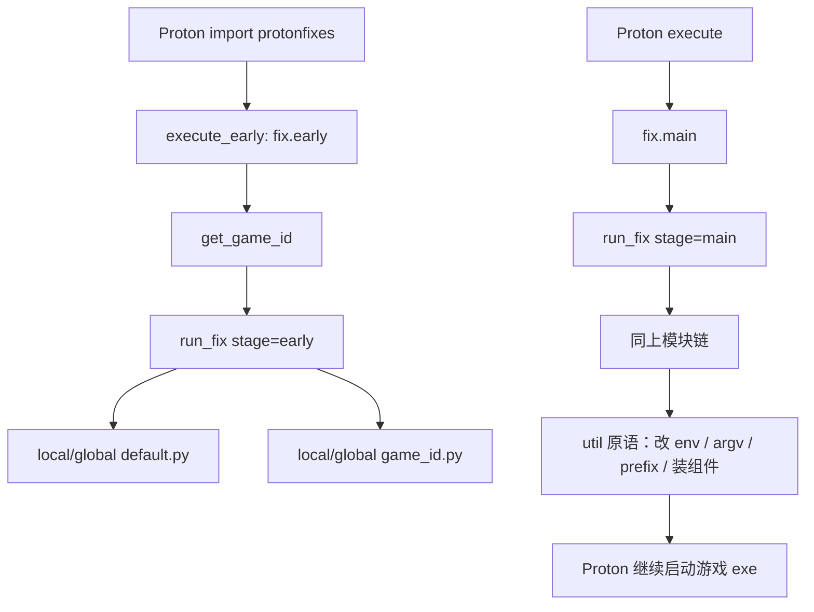

# umu-protonfixes 修复 Proton 游戏的逻辑分析报告

> 分析对象：`fixing_tools/umu-protonfixes`（运行时 Python 包名 `protonfixes`）
> 一句话定位：umu-protonfixes 是 UMU-Proton / GE-Proton 的**按游戏自动修复框架**，在 Proton 启动游戏前/中注入针对单个游戏的补丁与 workaround（装 winetricks 组件、改环境变量、改启动命令、改注册表、装反作弊运行时等）。

---

## 1. 整体定位

与 protontricks（用户手动操作单个 prefix）不同，umu-protonfixes 是**自动化、按游戏 ID 触发**的修复框架，内置了数百个游戏的修复脚本，游戏启动时自动匹配并应用。

它是 Proton "开箱即用失败"游戏的临时补救方案，核心手段：安装 Winetricks verb、改环境变量、改启动命令、改注册表、装反作弊运行时等。

**与 Proton 的集成方式**（`__init__.py`）：

| 阶段 | 函数 | 时机 |
|------|------|------|
| 模块 import 时 | `execute_early()` | 立即执行 `fix.early()` |
| Proton 显式调用 | `setup(env, ...)` | 把 `files/bin`、`files/lib` 注入 PATH / LD_LIBRARY_PATH |
| Proton 显式调用 | `execute()` | 显示 Zenity 等待框后执行 `fix.main()` |

**运行条件**（`check_conditions()`）：
- 存在 `STEAM_COMPAT_DATA_PATH`；
- `sys.argv[1]` 含 `waitforexitandrun`（真实游戏启动，而非 setup）；
- 未设置 `PROTONFIXES_DISABLE=1`。

**深层 hook**：`util.py` 通过 `import __main__ as protonmain` 访问 Proton 主脚本，直接修改 `protonmain.g_session.env`、`sys.argv`、`g_session.compat_config` 等。

---

## 2. 入口流程：game id → gamefix 模块

核心文件：`fix.py`。

### 2.1 获取 game id —— `get_game_id()`
优先级（带 `@lru_cache`）：
1. `UMU_ID`（非 Steam / umu-launcher）；
2. `SteamAppId`；
3. `SteamGameId`；
4. 从 `STEAM_COMPAT_DATA_PATH` 路径末尾提取数字。
全部失败则 `log.crit` 并 `exit()`。

### 2.2 确定模块路径 —— `get_module_name()`
```python
if game_id.isnumeric():
    store = 'steam'                       # protonfixes.gamefixes-steam.<id>
elif os.environ.get('STORE'):
    store = os.environ['STORE'].lower()   # protonfixes.gamefixes-<store>.<id>
else:
    store = 'umu'                         # protonfixes.gamefixes-umu.<id>
```
本地自定义修复：`localfixes.<id>`（`~/.config/protonfixes/localfixes/`）。

### 2.3 执行顺序 —— `run_fix()` → `_run_fix()`
```
run_fix(game_id, stage='early'|'main')
  ├─ [可选] run_checks()           # 受 config.main.enable_checks 控制
  ├─ default.py（先 local 后 global） # 全局默认；Steam 版会解析 -pf_* 启动参数
  └─ <game_id>.py（先 local 后 global） # 游戏专属修复
```
**关键规则**：本地 fix 存在时**完全覆盖**全局 fix，不会两者都跑。

### 2.4 模块加载 —— `_run_fix()`
```python
game_module = import_module(module_name)
if stage == 'early':
    game_module.early_with_id(game_id) or game_module.early()
elif stage == 'main':
    game_module.main_with_id(game_id) or game_module.main()
```

### 2.5 跳过场景 —— `_entry_check()`
当 `sys.argv` 含 `iscriptevaluator.exe` / `getcompatpath` / `getnativepath` 时不运行 fix。

---

## 3. gamefix 模块结构

每个游戏一个 `.py`，命名规则：
- **Steam**：`<AppID>.py`（如 `39190.py`）；
- **其他平台**：`umu-<id>.py` 或 UUID 形式。

典型结构：
```python
from protonfixes import util

def early() -> None:      # 可选，在 main 之前
    ...

def main() -> None:       # 必需（或被 main_with_id 替代）
    util.protontricks('vcrun2022')
    util.set_environment('SOME_VAR', '1')
```

- 可选入口 `early_with_id(game_id)` / `main_with_id(game_id)`：同一 fix 服务多个 id 时用。
- `default.py`：每个 store 目录下的全局默认；Steam 的 `gamefixes-steam/default.py` 会解析启动参数 `-pf_tricks`、`-pf_dxvk_set`、`-pf_replace_cmd`。
- 本地覆盖：`~/.config/protonfixes/localfixes/<id>.py` 或 `default.py`。

---

## 4. util.py 提供的修复"原语"

文件：`util.py`。这是整个框架的工具箱，gamefix 脚本通过组合这些函数完成修复。

### 4.1 Winetricks / 组件安装
| 函数 | 作用 |
|------|------|
| `protontricks(verb)` | 在 prefix 中运行 `winetricks --unattended`；已装则跳过（**注意：函数名叫 protontricks，实际调用的是系统 winetricks 二进制**） |
| `checkinstalled(verb)` | 查 `winetricks.log` / `winetricks.log.forced` |
| `is_custom_verb(verb)` | 查找本地或内置 `verbs/<verb>.verb` |
| `install_all_from_tgz(url)` / `install_from_zip(url, filename)` | 下载并解压到游戏目录 |

`@once` 装饰器：在 `pfx/drive_c/protonfixes/run/` 写标记，保证每个 prefix 只执行一次。

### 4.2 命令行 / 环境变量
| 函数 | 作用 |
|------|------|
| `replace_command(orig, repl)` | 正则替换 `sys.argv` 中启动的可执行文件 |
| `append_argument(arg)` | 追加启动参数 |
| `set_environment(name, val)` / `del_environment(name)` | 写/删 `os.environ` 与 `protonmain.g_session.env` |

### 4.3 Wine DLL / EXE 覆盖
| 函数 | 作用 |
|------|------|
| `winedll_override(dll, OverrideOrder)` | 设置 `WINEDLLOVERRIDES`（n / b / n,b / b,n / 空=禁用） |
| `wineexe_override(exe, OverrideOrder)` | 同上，针对 `.exe` |
| `disable_nvapi()` | 禁用 nvapi/nvcuda 等 DLL |

`OverrideOrder` 枚举：`DISABLED`、`NATIVE`、`BUILTIN`、`NATIVE_BUILTIN`、`BUILTIN_NATIVE`。

### 4.4 注册表
| 函数 | 作用 |
|------|------|
| `regedit_add(folder, name, typ, value, arch=False)` | 通过 `wine reg add` 写注册表；`arch=True` 写 64 位视图 |

### 4.5 DXVK / 图形
| 函数 | 作用 |
|------|------|
| `set_dxvk_option(opt, val, cfile=...)` | 生成/合并 DXVK 配置，设 `DXVK_CONFIG_FILE` |
| `patch_libcuda()` | 修补 libcuda.so 修复 DLSS 相关崩溃 |
| `disable_protonmediaconverter()` | 设 `PROTON_AUDIO/VIDEO_CONVERT=0`、`PROTON_DEMUX=0` |
| `get_resolution()` | 从 xrandr 取分辨率 |

### 4.6 Proton 同步 / 特性开关
`disable_esync()`、`disable_fsync()`、`disable_ntsync()`（置空对应 `WINE*SYNC`）、`set_game_drive(enabled)`（控制 `gamedrive` compat 选项）。

### 4.7 反作弊运行时
| 函数 | 作用 |
|------|------|
| `install_eac_runtime()` | 安装 Steam AppID `1826330`（Proton EAC Runtime） |
| `install_battleye_runtime()` | 安装 AppID `1161040`（Proton BattlEye Runtime） |

底层走 `steamhelper.install_app()` → `steam://install/<appid>` + 轮询 `appmanifest_*.acf`。

### 4.8 配置文件编辑
`set_ini_options()`、`set_xml_options()`、`create_dosbox_conf()`、`create_backup_config()`（首次修改前备份 `.protonfixes.bak`）。`BasePath` 支持 `USER`（My Documents）、`GAME`、`APPDATA_LOCAL`。

### 4.9 CPU 拓扑
`set_cpu_topology()`、`set_cpu_topology_nosmt()`、`set_cpu_topology_limit()`（设 `WINE_CPU_TOPOLOGY`），辅助 `is_smt_enabled()`、`get_cpu_count()`。

### 4.10 存档 / Steam 辅助
`import_saves_folder()`（跨游戏 prefix symlink/复制存档）、`get_steam_account_id()`、`get_game_install_path()`、`protonprefix()`、`protondir()`。

### 4.11 配套模块（由 Proton 主脚本调用，非 gamefix 直接调用）
- `upscalers.py` 的 `setup_upscalers(...)`：按 compat_config 中 `dlss`/`xess`/`fsr3`/`fsr4` 等，下载并安装 upscaler DLL，设置 `WINE_LOADDLL_REPLACE`。
- `utilities.py`：`setup_frame_rate`、`setup_local_shader_cache`、`setup_mount_drives`、`winetricks`（umu 专用 winetricks-gui 入口）。

---

## 5. engine.py / config / checks 的作用

### engine.py —— 游戏引擎检测
单例 `engine = Engine()`，启动时自动检测 Unity、RAGE、Dunia 2、UE3/UE4，并提供引擎相关启动参数：`nosplash()`、`nointro()`、`launcher()`、`windowed()`、`resolution(res)` 等（通过 `_add_argument()` 改 `sys.argv`）。

### config_base.py + config.py —— 用户配置
路径 `~/.config/protonfixes/config.ini`（不存在自动创建）：

| Section | 字段 | 默认 | 含义 |
|---------|------|------|------|
| `[main]` | `enable_checks` | true | 是否运行 `checks.py` |
| `[main]` | `enable_global_fixes` | true | 是否运行内置 gamefixes-* |
| `[path]` | `cache_dir` | `~/.cache/protonfixes` | 缓存/解压目录 |

### checks.py
`run_checks()` 目前仅 `esync_file_limits()`：检查 `/proc/sys/fs/file-max` 是否 ≥ 8192。

---

## 6. 与 protontricks / winetricks 的协作

`util.protontricks()` 实际调用系统 `winetricks` 二进制，流程：
1. `checkinstalled(verb)`：已装则返回；
2. `check_internet()`：无网则跳过；
3. 构造 Wine 环境（`WINEPREFIX`、`WINE`、`WINESERVER` 来自 `protonmain.g_proton`）；
4. 若命中 `is_custom_verb(verb)` → 使用 `verbs/<verb>.verb` 路径；
5. 执行 `winetricks --unattended [custom_verb_path]`；
6. 把 `sys.argv` 中 `run` 改为 `waitforexitandrun`，让 Proton 等待 winetricks 完成；
7. `wineserver -w` 等待，`_killhanging()` 清理卡死进程；
8. 失败或未写入 log 时用 `_forceinstalled(verb)` 强制标记。

**自定义 verb**（`verbs/` 目录）：如 `xliveless.verb` 下载 Ultimate-ASI-Loader，把 `dinput8.dll` 复制为 `xlive.dll` 并设 native override。本地覆盖路径 `~/.config/protonfixes/localfixes/verbs/`。

**Steam 启动参数快捷方式**（`gamefixes-steam/default.py`）：`-pf_tricks=xliveless` → `util.protontricks('xliveless')`。

> 三者关系：umu-protonfixes 在 prefix 内**内嵌调用 winetricks**；protontricks 是用户手动管理 prefix 的独立 CLI；三者共享同一套 verb 生态。

---

## 7. gamefixes-* 目录含义

| 目录 | 平台 | 约数量 | ID 格式 |
|------|------|--------|---------|
| `gamefixes-steam/` | Steam | ~354 | 纯数字 AppID |
| `gamefixes-gog/` | GOG | ~68 | `umu-<gog_id>.py` |
| `gamefixes-egs/` | Epic Games Store | ~31 | `umu-<id>.py` |
| `gamefixes-ea/` | EA App | ~1 | `umu-*.py` |
| `gamefixes-ubisoft/` | Ubisoft Connect | ~8 | `umu-*.py` |
| `gamefixes-battlenet/` | Battle.net | ~1 | `umu-*.py` |
| `gamefixes-amazon/` | Amazon Games | ~1 | `umu-*.py` |
| `gamefixes-humble/` | Humble | ~3 | `umu-*.py` |
| `gamefixes-itchio/` | itch.io | ~1 | `umu-*.py` |
| `gamefixes-zoomplatform/` | ZOOM Platform | ~12 | `umu-*.py` / UUID |
| `gamefixes-umu/` | 通用 / 无 STORE | ~27 | `umu-<slug>.py` |

路由逻辑：纯数字 game id 始终走 `gamefixes-steam`；非数字 + `STORE=egs|gog|...` 走对应目录；非数字且无 STORE 走 `gamefixes-umu`。非 Steam 游戏依赖 umu-database（`umu-database.csv`）提供 `UMU_ID` 与 `STORE` 映射。

---

## 8. 具体游戏修复示例

| 游戏 / 文件 | 实际修了什么 |
|-------------|--------------|
| **Star Citizen**（`gamefixes-umu/umu-starcitizen.py`） | `patch_libcuda()` 修 DLSS 崩溃；为 `cryptbase.dll` 等创建指向 `security.dll` 的 symlink；`protontricks('powershell')`/`('vcrun2022')`；`winedll_override('dxwebsetup.exe', DISABLED)` 防 Launcher 挂死 |
| **Fall Guys**（`gamefixes-steam/1097150.py`） | `install_eac_runtime()` 装反作弊运行时；`set_environment('DOTNET_BUNDLE_EXTRACT_BASE_DIR', '')` |
| **Bully**（`gamefixes-steam/12200.py`） | `disable_protonmediaconverter()` 修 GE-Proton 9.11+ 视频有画面无声音 |
| **Genshin / Zenless**（`gamefixes-umu/`） | `early()` 设 `set_game_drive(True)`；`main()` 设 `UMU_USE_STEAM=1`（反作弊要求从 steam.exe 启动）、`WINE_DISABLE_VULKAN_OPWR=1` |
| **The Blind Prophet**（`gamefixes-steam/968370.py`） | `winedll_override('d3d9', DISABLED)`；`protontricks('segoe_script')` 装字体 |

---

## 9. 架构流程图



---

## 10. 关键文件索引

| 文件 | 职责 |
|------|------|
| `__init__.py` | Proton 集成入口、条件检查、early/main 调度 |
| `fix.py` | game id 解析、模块路由、fix 执行链 |
| `util.py` | 全部修复原语 |
| `engine.py` | 引擎检测与通用启动参数 |
| `config.py` / `config_base.py` | 用户配置 |
| `checks.py` | 启动前健康检查 |
| `steamhelper.py` | Steam App 安装（EAC / BE runtime） |
| `upscalers.py` | DLSS/XeSS/FSR DLL 自动安装升级 |
| `utilities.py` | Proton 主脚本级辅助（帧率、shader cache、挂载盘） |
| `verbs/*.verb` | 自定义 Winetricks verb |
| `gamefixes-*/` | 按平台 / 游戏 ID 的修复脚本库 |

**结论**：umu-protonfixes 在 Proton 启动游戏的钩子点，根据 game id 自动路由到对应平台目录的修复脚本，脚本通过调用 `util.py` 的修复原语（装 winetricks 组件、覆盖 DLL、改注册表/环境变量/启动命令、装反作弊运行时、配置 DXVK/upscaler 等）对单个游戏施加针对性 workaround，把"开箱失败"的游戏变得可玩。它与 winetricks 共享 verb 生态，是 protontricks（手动）之外的**自动化、按游戏**修复方案。
